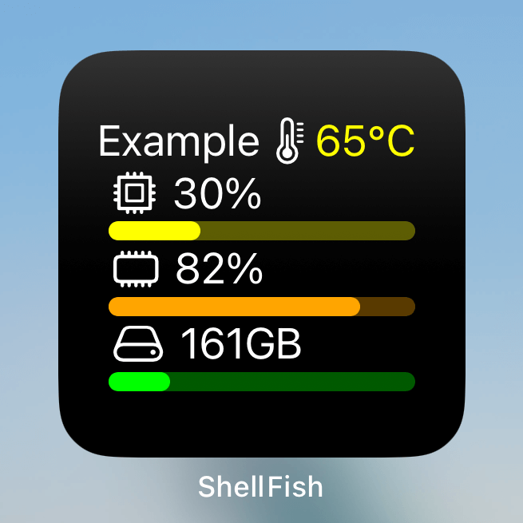
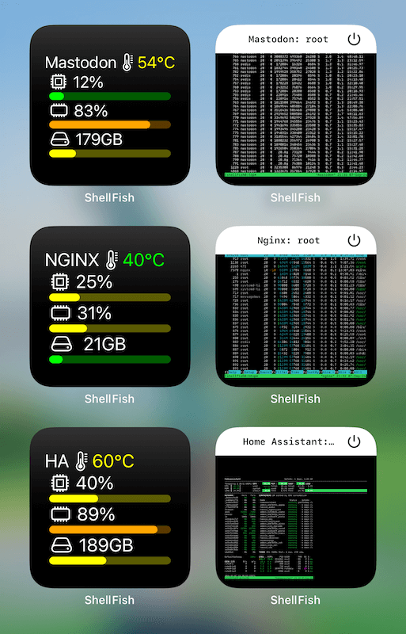

# ShellFish-Widgets

[](https://app.codacy.com/gh/jmrplens/ShellFish-Widgets?utm_source=github.com&utm_medium=referral&utm_content=jmrplens/ShellFish-Widgets&utm_campaign=Badge_Grade)

Bash scripts to send information from the server to the widget.

It is important to have the `.shellfishrc` file on the server. To do this, go to the app options in iOS, select `Shell Integration`, press `Install`, and choose the server where you want to include it.

The file will be added to the home folder of your user on the server. If it is different from root, modify the path in the third line of the script `source /root/.shellfishrc` to the correct one `source /your_user/.shellfishrc`.

## Dependencies

Your server must have the following tools installed:

- `curl`: To send the information to the widget. [More info](https://curl.se/)
- `jq`: To process the JSON response. [More info](https://stedolan.github.io/jq/)

## Usage

All the widgets that will be added to this repository will be used in the same way. If there is any difference, it will be indicated in its section.

1. Download the .sh file to your server, for example (you can change the path `/opt/shellfish_widgets` to any other:

   ```shell
   mkdir /opt/shellfish_widgets
   cd /opt/shellfish_widgets
   wget https://github.com/jmrplens/ShellFish-Widgets/raw/main/small_widget_A.sh
   ```

2. Enable its execution:

   ```shell
   chmod +x /opt/shellfish_widgets/small_widget_A.sh
   ```

3. Run it:

   ```shell
   /opt/shellfish_widgets/small_widget_A.sh --server_name Example
   ```

   With this, you will have already sent the information to the widget you set on your iOS. If you want, you can configure some details:
   - **Server name**: This is the name that will appear on the widget, if it is not configured, the hostame of the server will be used `--server_name Example`.
   - **Disk**: If you want to send the used space of a disk other than the main one `--disk /volumeX`.
   - **CPU temperature**: If you want to use another sensor or manually specify the sensor because it is not recognized `--cpu_sensor Tctl`.
   - **Target**: To send/create the information to a specific widget, indicate the widget's reference `--target Small_A`.

4. (Optional) Add it to the crontab (in this example, it runs every 10 minutes) to have updated information periodically:

   ```shell
   { crontab -l; echo "*/10 * * * * /opt/shellfish_widgets/small_widget_A.sh"; } | crontab -
   ```

   or `crontab -e` and add a new line with `*/10 * * * * /opt/shellfish_widgets/small_widget_A.sh`

### Small Widgets

#### Type A

By running `./your_path/small_widget_A.sh --server_name Example`, the widget will look like this:



Using the parameter `--target XX` you can display the information of several servers in different widgets:

- `./your_path/small_widget_A.sh --server_name Mastodon --target Mastodon_Small`
- `./your_path/small_widget_A.sh --server_name NGINX --target NGINX_Small`
- `./your_path/small_widget_A.sh --server_name HA --target Home_Assistant_Small`


